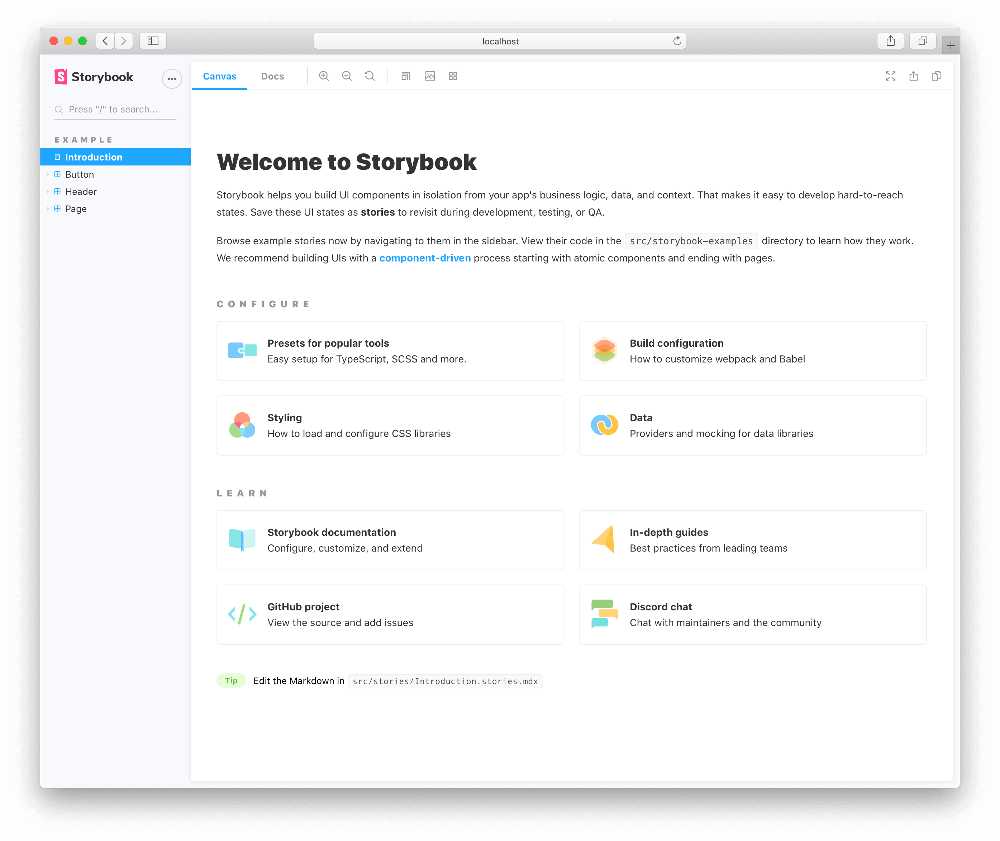

# ReactStorybook

#### 前提条件

- 已经运行`CRA`，拥有初始项目，并能正确创建`ts`文件和运行。
- **参考地址**：`https://storybook.js.org/docs/react/get-started/install`
- `npx sb init`
- `yarn storybook`/`npm run storybook`

#### Antd

以`Antd`组件作为参考组件进行模拟，在`src`文件夹下创建单个组件文件夹，在文件夹内完成`[name].stories.tsx`的定义。

`[name].type.ts`用于扩展`Antd`组件`Props`

**组件文件夹建议首字母大写，否则可能出现定义的`PropsType`未展示问题。**